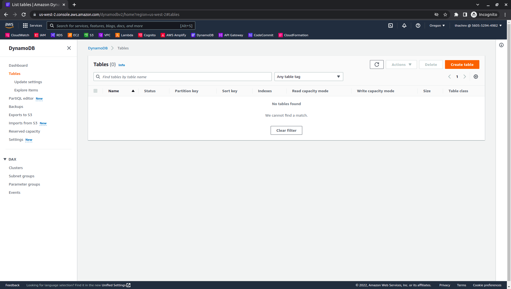
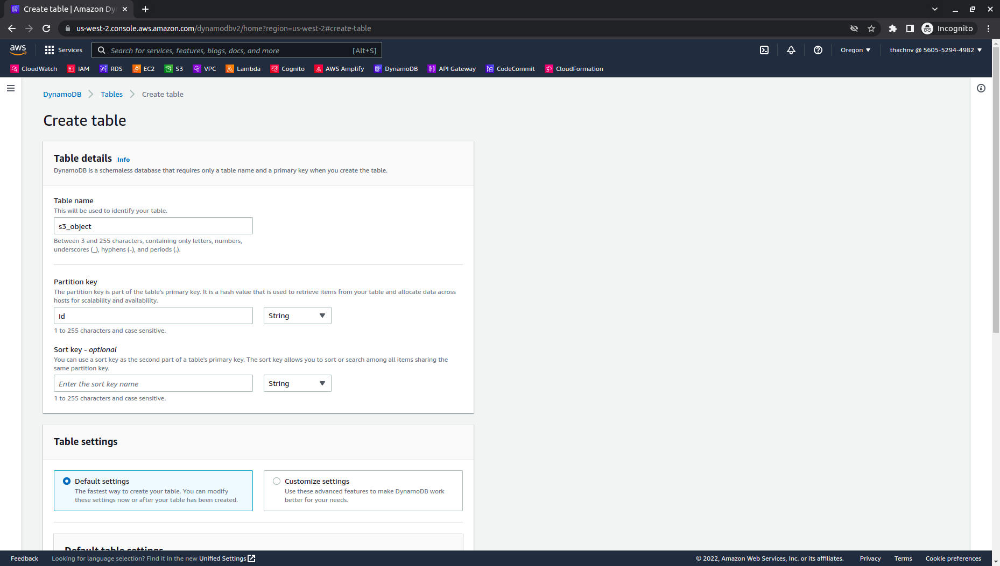

# 
1. Create table on DynamoDB

# Guide

1. Sign in to the AWS Management Console and open the DynamoDB console at https://console.aws.amazon.com/dynamodbv2/
2. In the navigation pane, choose **Tables**, and then choose **Create table**.
   

3. In **Table details** panel, fill information:

   - Table name: `s3_object` (Note table name for using in [Step 3. Create Lambda function](3-Lambda/README.md).

   - Partition key: `id` (Note table name for using in [Step 3. Create Lambda function](3-Lambda/README.md).

   

4. On the **Table settings** and **Tags** panel, leave all the defaults and select **Create table**.

   

***
Next page: [2. Create S3 bucket](../2-S3/README.md)