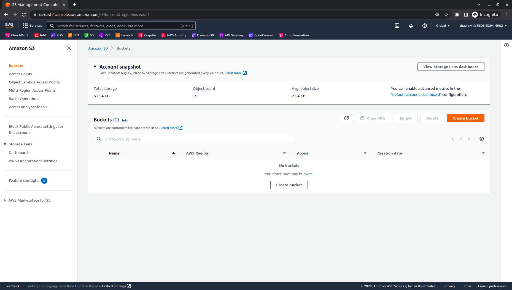
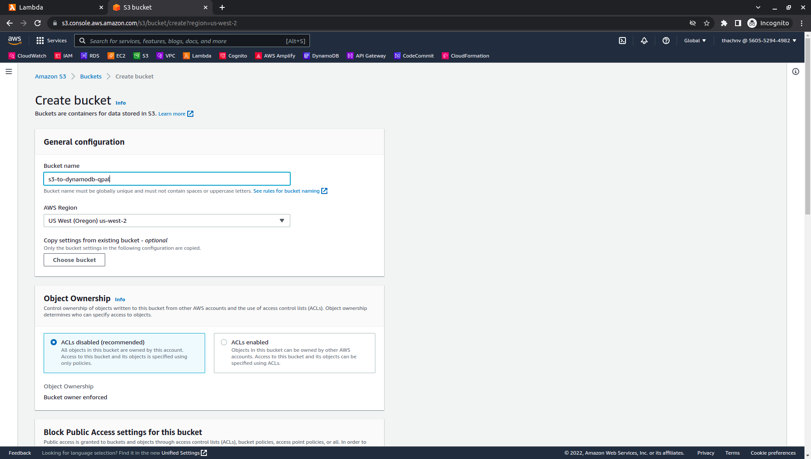
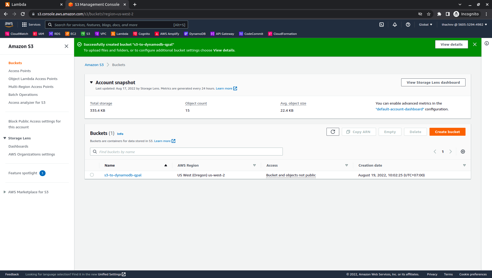

# 
2. Create S3 bucket

# Guide

1. Sign in to the AWS Management Console and open the S3 console at https://console.aws.amazon.com/s3/
2. In the navigation pane, choose **Buckets**, and then choose **Create bucket**.
   

3. In **General configuration** panel, fill information:

   - Bucket name: `s3-to-dynamodb-xxxx`. *xxxx is character random*, because Bucket name must be globally unique and must not contain spaces or uppercase letters. (Note bucket name for using in [Step 3. Create Lambda function](3-Lambda/README.md).
  
   

4. On the other panel, leave all the defaults and select **Create bucket**.

   

***
Next page: [3. Create Lambda function](../3-Lambda/README.md)