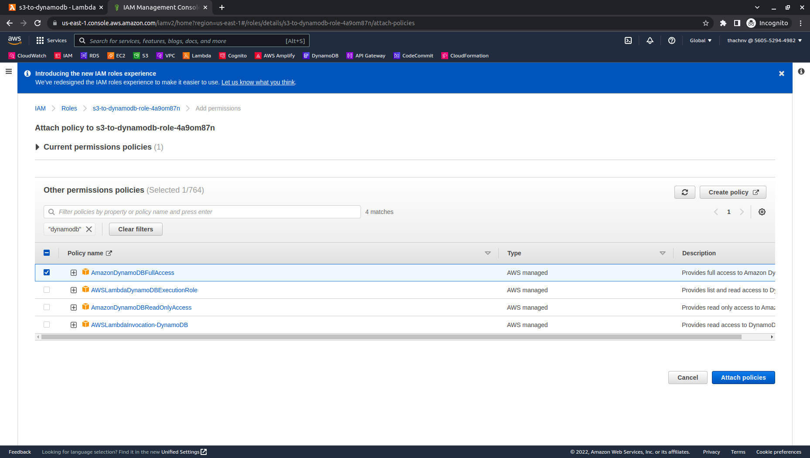

# 
3. Create Lambda function

# Guide

1. Sign in to the AWS Management Console and open the Lambda console at https://console.aws.amazon.com/lambda/. 

    *Note: Choose region same as created S3 bucket in [Step 2. Create S3 bucket](2-S3/README.md).*

2. In the navigation pane, choose **Funtions**, and then choose **Create function**.
   
   

3. On top of page, leave the default with **Author from scratch**.
   
4. In **Basic information** panel, fill information:
   - Function name: `s3-to-dynamodb`.
   - For Runtime, select `Python 3.9` from dropdown.
  
   

5. On the **Advanced settings** panel, leave all the defaults and select **Create function**.

   

6. After function is created. Choose **Configuration**, and then choose **Permissions**.
   
   

7. Under **Resource summary**, review the services and resources that the function can access.
   
   

8. In **Execution role** panel, click to link under Role name.
   
   

9.  In **Permissions**, select **Add permissions** then **Attach policies**.
    
    *Note: Grant least privilege access to your Lambda execution role. Ref [Apply least-privilege permissions](https://docs.aws.amazon.com/IAM/latest/UserGuide/best-practices.html#grant-least-privilege).
    However, in this lab, we will pass by this for easier.*
   

10. Filter and check `AmazonDynamoDBFullAccess`, `AmazonS3FullAccess`. Choose **Attach policies**. Close this tab and get back Lambda console.
   
   
   
   

11. On the top, Click to **Add trigger** in **Function overview** panel.
   
   

12. In **Trigger configuration**, type `S3` and select `S3` from dropdown.
    - In **Bucket**, choose bucket created in [Step 2. Create S3 bucket](2-S3/README.md).
    - In **Event type**, select `PUT` from dropdown. Leave all the defaults and check to **Recursive invocation**. Select **Add**.

    
    

13. Choose **Code**, and then update code in lambda_function.
   

14. Click to **Deploy** after update code.

   Ref [lambda_function.py](functions/lambda_function.py)
    
***
Next page: [4. Testing the function](../4-Testing/README.md)