# 
4. Testing the function

# Guide

1. Click to **Test** dropdown. Click to **Configure test event**. Or press combo key `Ctrl + Shift + C`.

   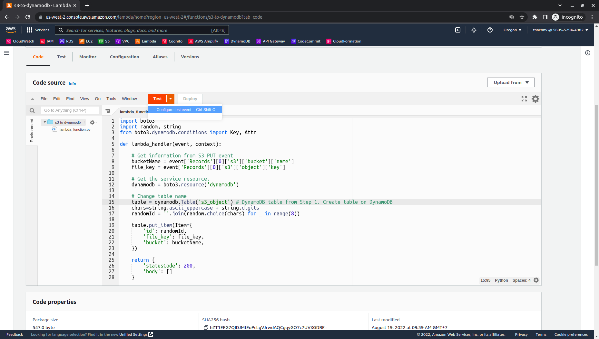

2. In the **Configure test event** dialog, confirm that `Create new event` is selected in **Test event action**.

   - Event name: `test-event-1`. You can typing any name.

3. Leave all the defaults and paste example event JSON to box.

   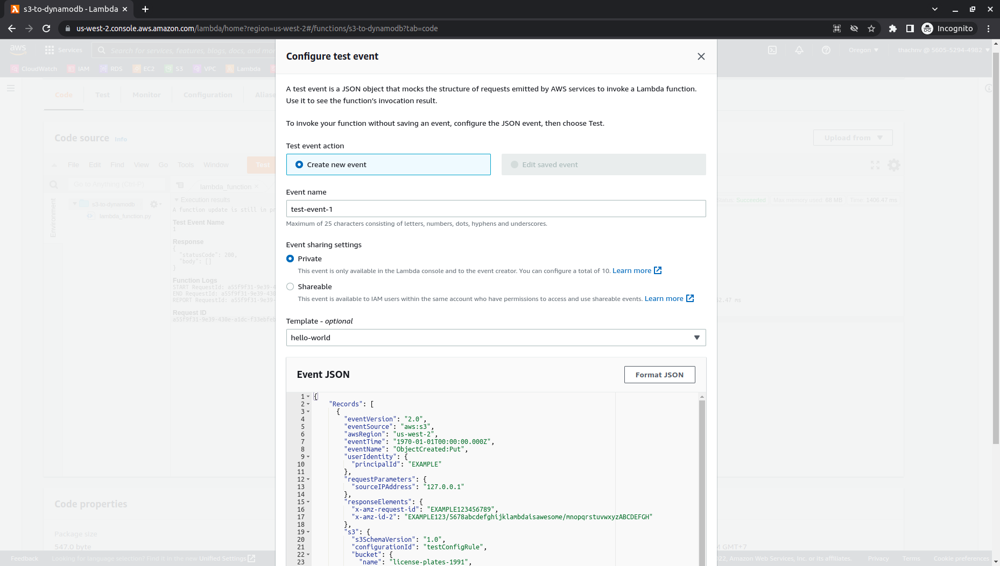
   Ref [lambda_function_sample.json](samples/lambda_function_sample.json)

4. Click to **Save**.
5. Check item in table of DynamoDB before run test
   - Open the DynamoDB console at https://console.aws.amazon.com/dynamodbv2/.
   - In the navigation pane, choose **Tables**, and then choose table which created in [Step 1. Create table on DynamoDB](1-DynamoDB/README.md)
   - Click to **Explore table items** to explore items.

   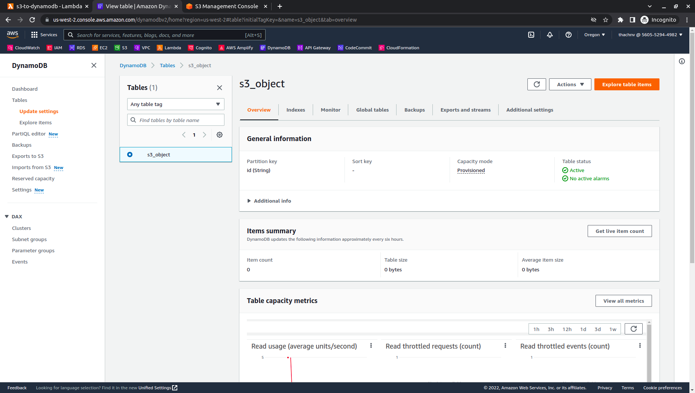
   - Click to **Run** to scan items.
   - Due to we don't have any event, so **Items returned** 0.

   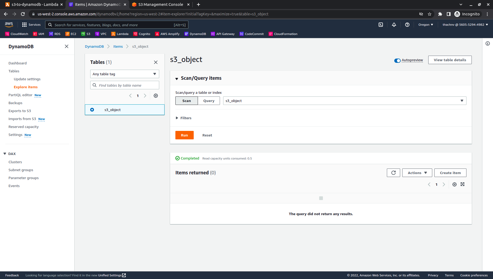
6. Go back Lambda Console. Click to **Test** for testing. If your code is ok, It will be return as below image.
    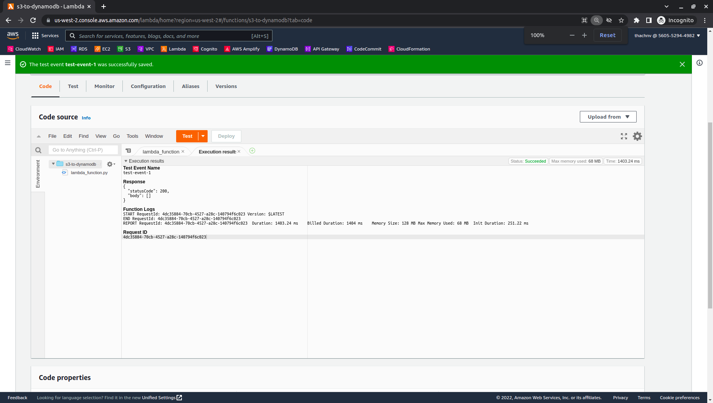

7. Go back DynamoDB console and **Run** to scan items again. It will be return **1** item as below image.
    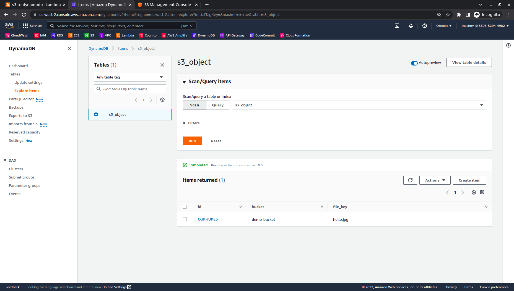
8. Now, try to upload an object and check table in DynamoDB.
   - Open the S3 console at https://console.aws.amazon.com/s3/
   - Click to bucket which created at [Step 1. Create S3 bucket](2-S3/README.md)
    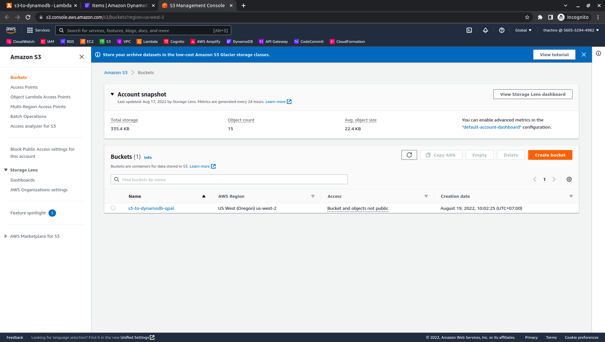
   - Click to **Upload** and **Add files**. Click to **Upload**.
    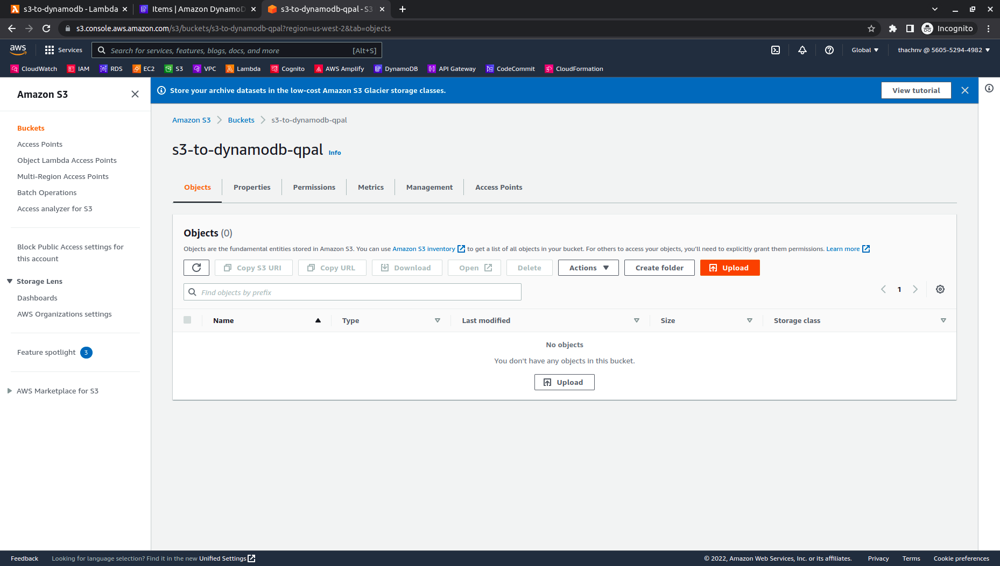
    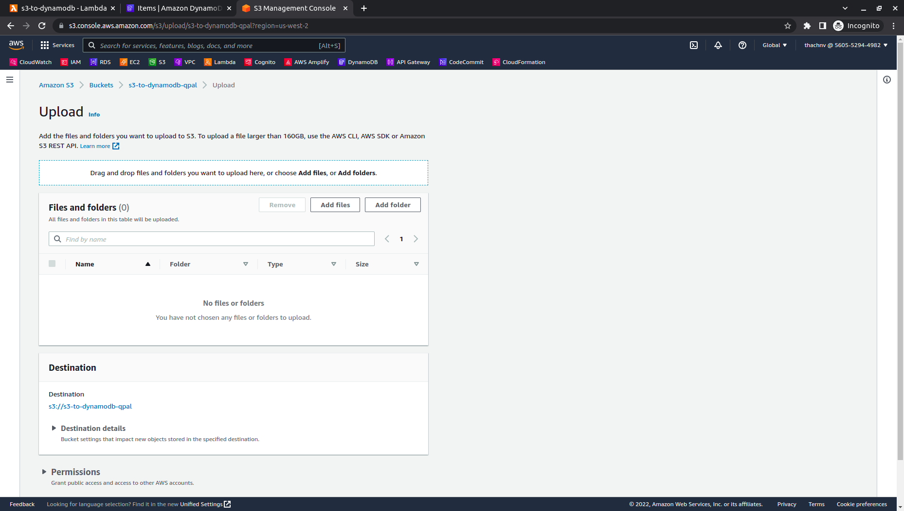
    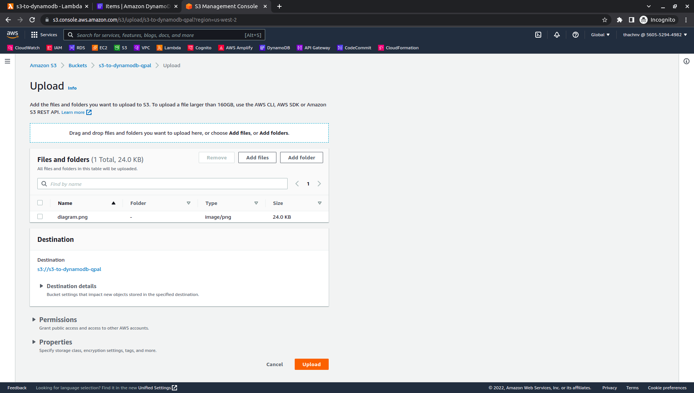
    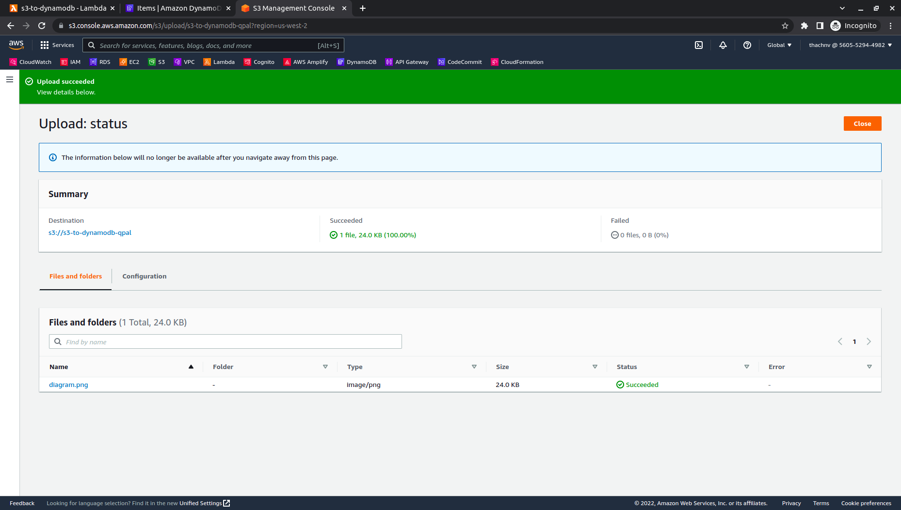
    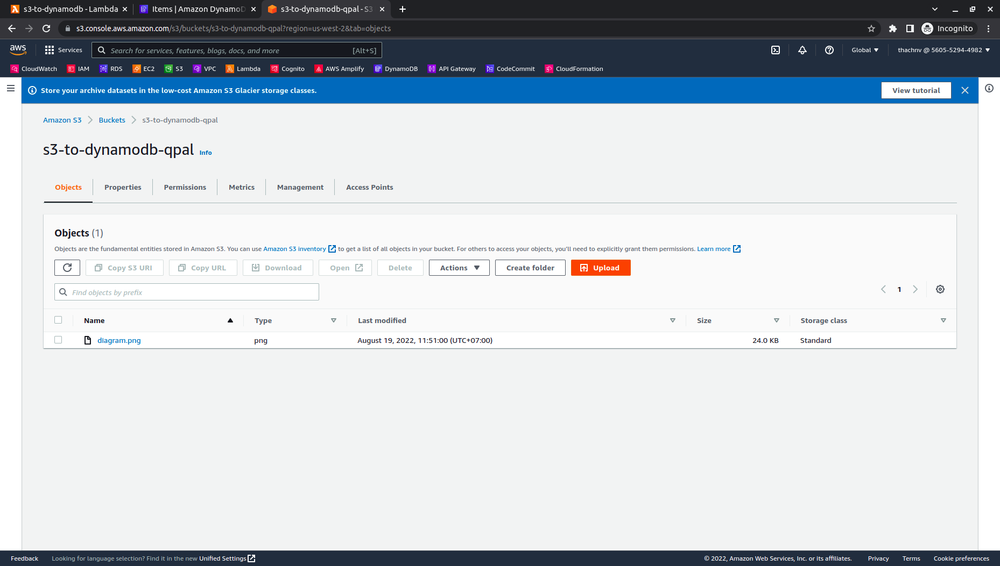
   - Go back DynamoDB console and **Run** to scan items again. It will be return **2** item as below image.
    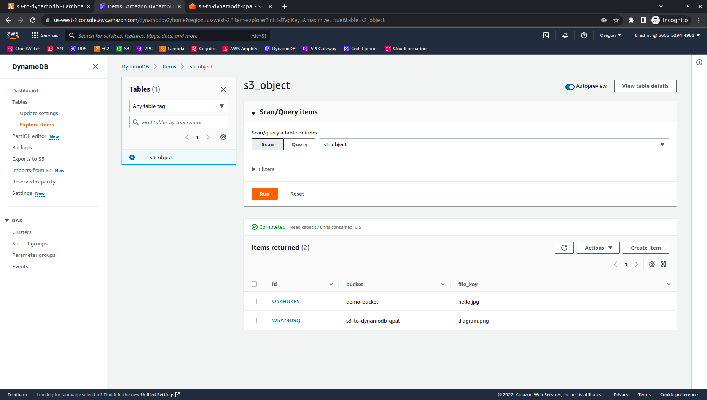

    Great. This function is running normal.

***
Next page: [5. Clean up your resources](../5-Clean-resources/README.md)