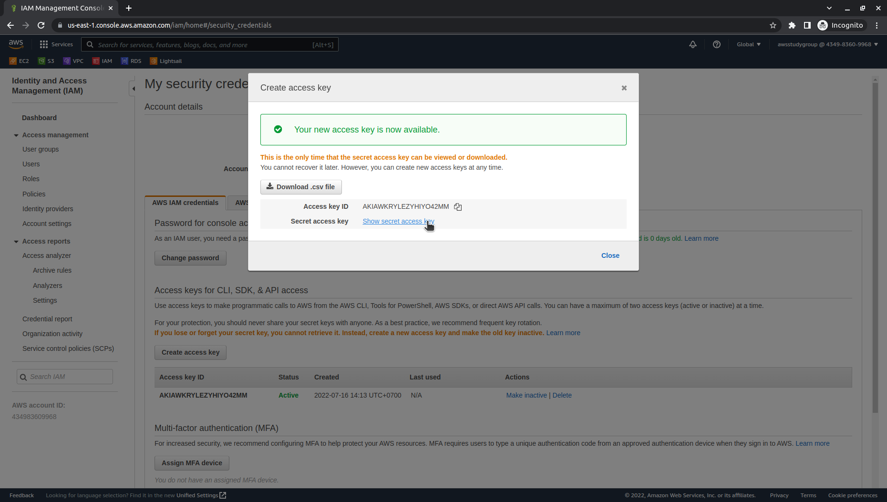
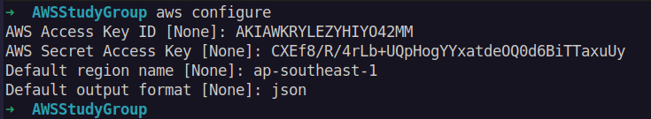

# <center>0.2. Configure the AWS CLI on Engineer machine</center>

# Guide
1. Sign in to the AWS Management Console and open the My security credentials https://console.aws.amazon.com/iam/home#/security_credentials

2. In the block **Access keys for CLI, SDK, & API access**, choose **Create access key**, and then take note **Access key ID** and **Secret access key**.



3. Configure credential

Run this command in cmd or terminal to config your credential:
```
aws configure
```

Note:
- AWS Access Key ID: **`Access key ID`** when you create access key in step 2
- AWS Secret Access Key: **`Secret access key`** when you create access key in step 2
- Default region name: **`region`** which you want to use with AWS CLI
- Default output format: 
  - **`json`** – The output is formatted as a JSON string.
  - **`yaml`** – The output is formatted as a YAML string.
  - **`yaml-stream`** – The output is streamed and formatted as a YAML string.  - Streaming allows for faster handling of large data types.
  - **`text`** – The output is formatted as multiple lines of tab-separated string  - values. This can be useful to pass the output to a text processor, like  - grep, sed, or awk.
  - **`table`** – The output is formatted as a table using the characters +|- to  - form the cell borders. It typically presents the information in a  - "human-friendly" format that is much easier to read than the others, but   - not as programmatically useful.

***Example**:*



***

For more detail, follow this [AWS page](https://docs.aws.amazon.com/cli/latest/userguide/cli-configure-quickstart.html). 

***


Next page: [Create an IAM instance profile for your Amazon EC2 instances](WordPress-0-3.md)