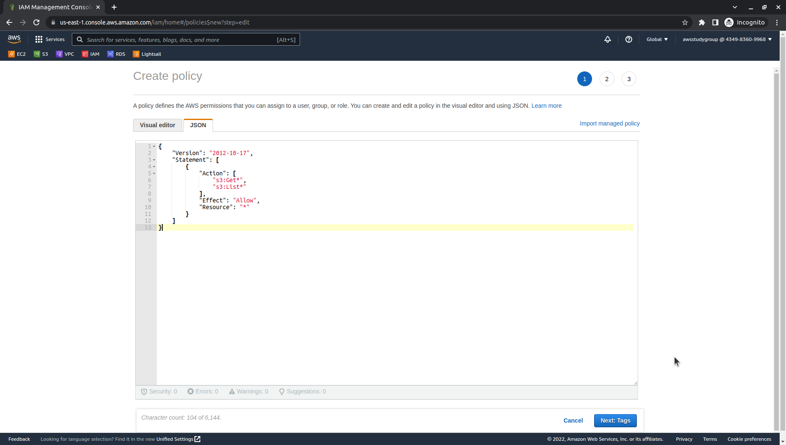
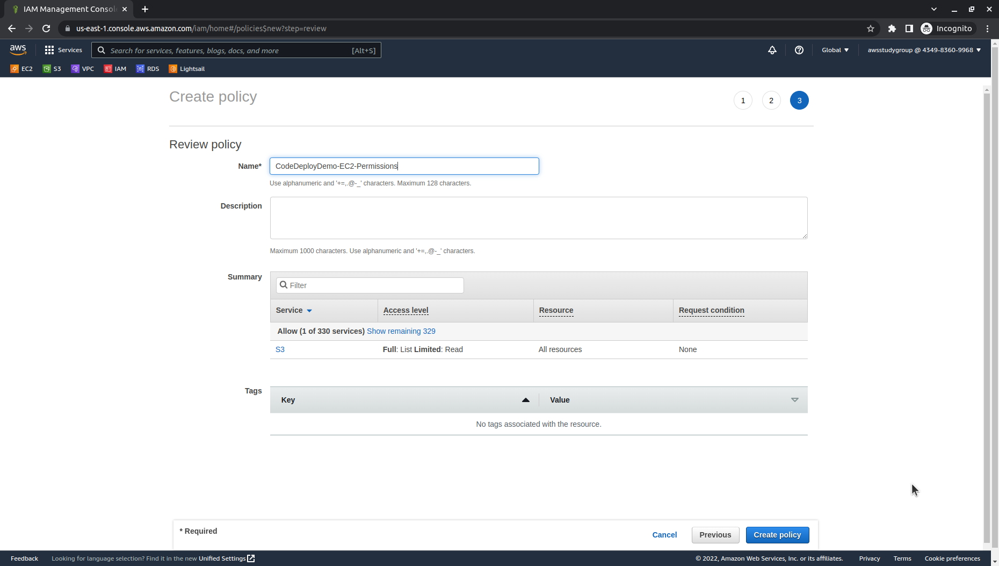
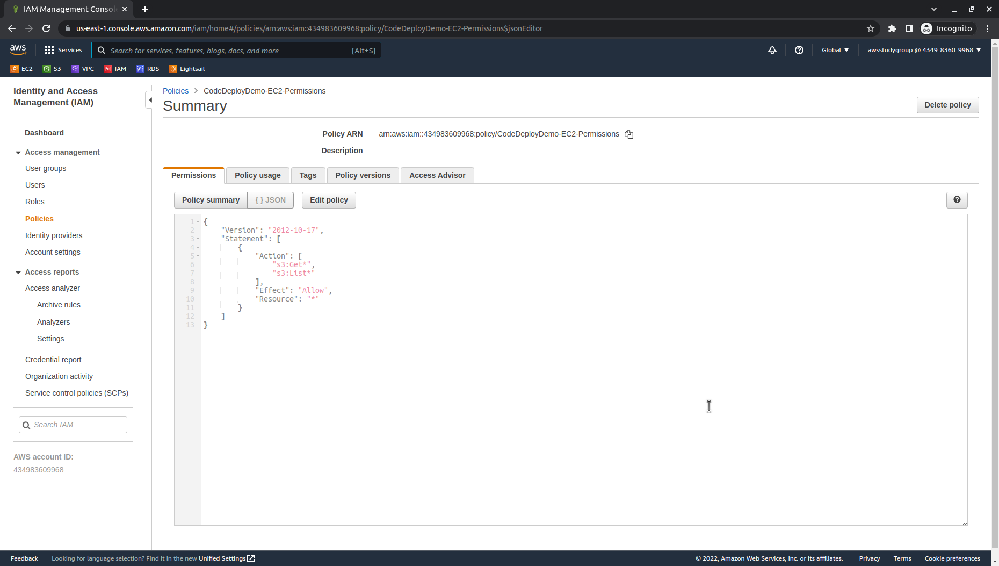
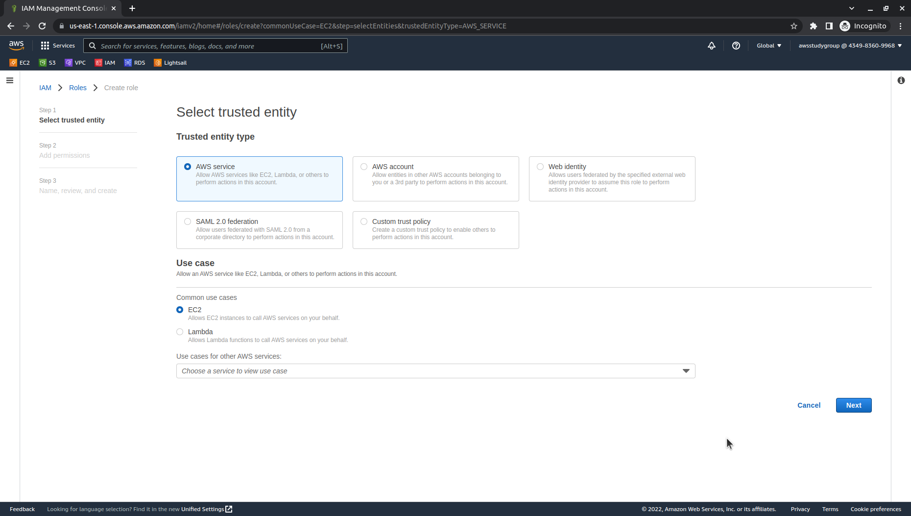
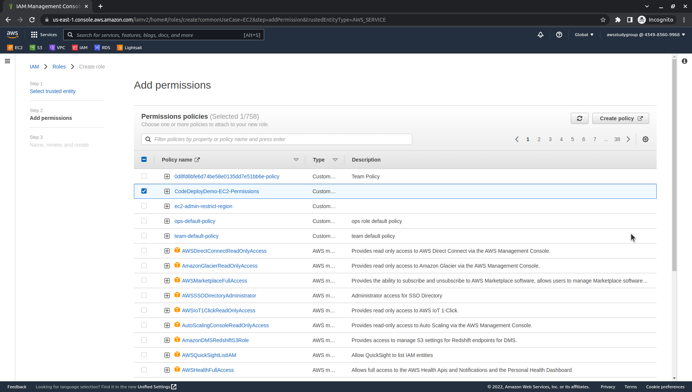
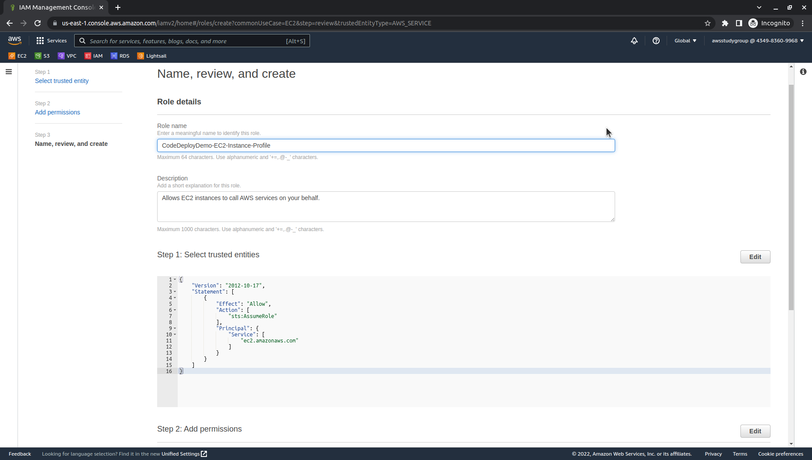
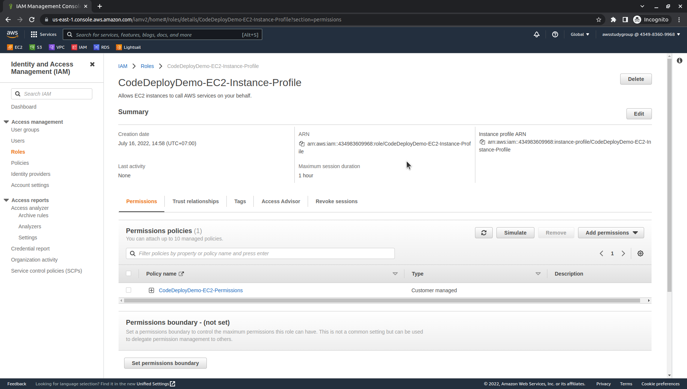

# <center>0.3. Create an IAM instance profile for your Amazon EC2 instances</center>

# Guide
1. Sign in to the AWS Management Console and open the IAM console at https://console.aws.amazon.com/iam/.
   
2. In the IAM console, in the navigation pane, choose **Policies**, and then choose **Create policy**.

3. On the Create policy page, paste the following in the **JSON tab**:

```
    {
        "Version": "2012-10-17",
        "Statement": [
            {
                "Action": [
                    "s3:Get*",
                    "s3:List*"
                ],
                "Effect": "Allow",
                "Resource": "*"
            }
        ]
    }
```



4. Choose **Next: Tags**.

5. Choose **Next: Review**.
6. On the Review page, in Policy name, enter a name for policy:
- Name: `CodeDeployDemo-EC2-Permissions`
- (Optional) For Description, type a description for the policy.



Choose **Create Policy**.



7. In the navigation pane, choose **Roles**, and then choose **Create role**.

8. At step 1: Select trusted entity, 
- **Trusted entity type**, choose **AWS service**
- **Use case**: choose **EC2**.



Choose **Next: Permissions**.

9. In the list of policies, select the check box next to the policy you just created (`CodeDeployDemo-EC2-Permissions`). If necessary, use the search box to find the policy.



Choose **Next**.

10. On the Review page, in Role name, enter a name for the service role:
- Name: `CodeDeployDemo-EC2-Instance-Profile`
- (Optional) For Description, type a description for the role.



Choose **Create role**.



***


Next page: [Create a service role for CodeDeploy](WordPress-0-4.md)