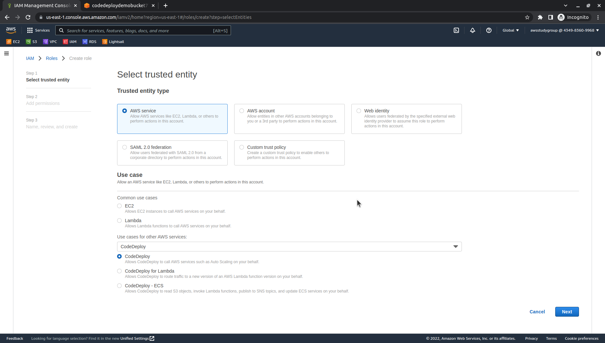
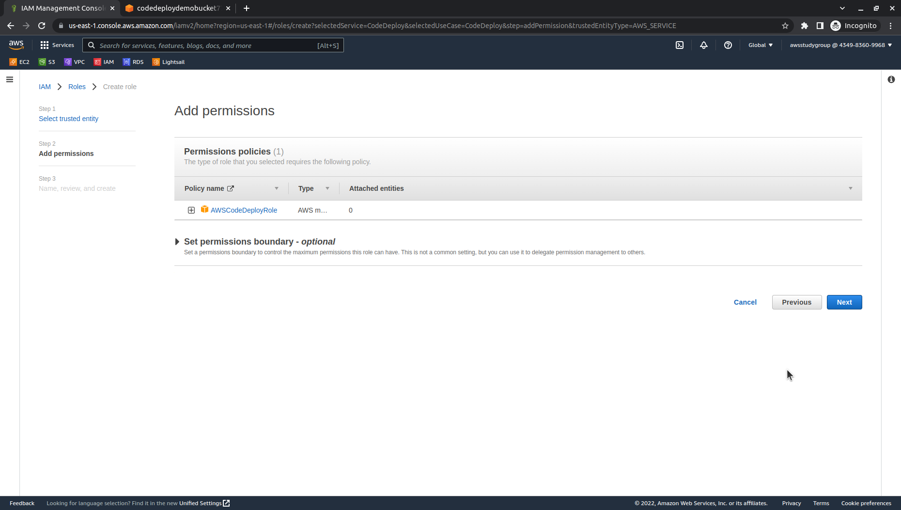
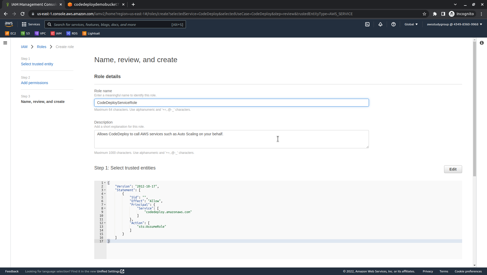
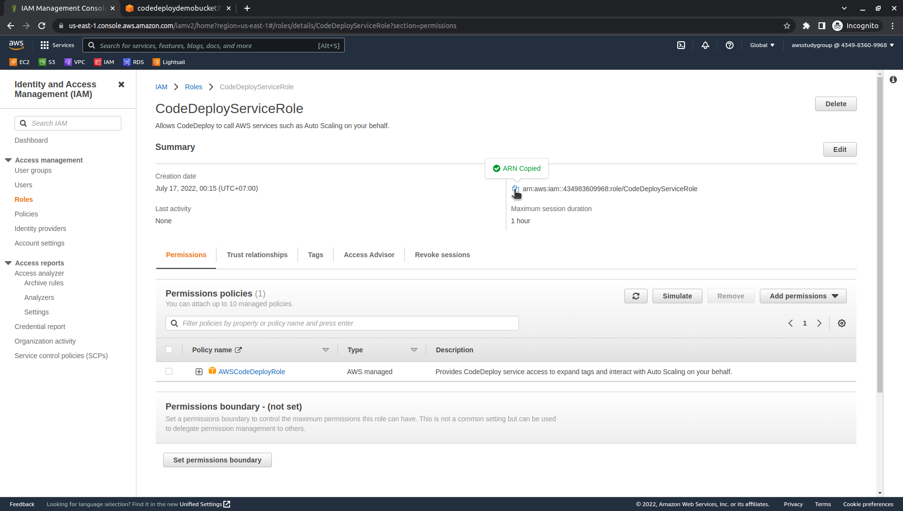

# 
0.4. Create a service role for CodeDeploy

# Guide
In AWS, service roles are used to grant permissions to an AWS service so it can access AWS resources. The policies that you attach to the service role determine which resources the service can access and what it can do with those resources.

The service role you create for CodeDeploy must be granted the permissions required for your compute platform. If you deploy to more than one compute platform, create one service role for each. To add permissions, attach one or more of the following AWS supplied policies:

For EC2/On-Premises deployments, attach the `AWSCodeDeployRole` policy. It provides the permissions for your service role to:

- Read the tags on your instances or identify your Amazon EC2 instances by Amazon EC2 Auto Scaling group names.
- Read, create, update, and delete Amazon EC2 Auto Scaling groups, lifecycle hooks, and scaling policies.
- Publish information to Amazon SNS topics.
- Retrieve information about CloudWatch alarms.
- Read and update Elastic Load Balancing.

# 1. Create a service role
1. Sign in to the AWS Management Console and open the IAM console at https://console.aws.amazon.com/iam/.

2. In the navigation pane, choose **Roles**, and then choose **Create role**.

3. On the Create role page, choose **AWS service**.

4. From **Use cases for other AWS services**, choose `CodeDeploy` and `CodeDeploy` below.
Choose **Next**.

5. On the Attached permissions policy page, the permission policy is displayed. Choose **Next**.

6. On the Review page, in Role name, enter a name for the service role (for example, `CodeDeployServiceRole`), and then choose **Create role**.

    You can also enter a description for this service role in Role description.

# 2. Get the service role ARN
To use the IAM console to get the ARN of the service role:

1. Sign in to the AWS Management Console and open the IAM console at https://console.aws.amazon.com/iam/.

2. In the navigation pane, choose **Roles**.

3. In the Filter box, type `CodeDeployServiceRole`, and then press Enter.

4. Choose `CodeDeployServiceRole`.

5. Make a note of the value of the **Role ARN** field.

***

Next page: [Launch and configure an Amazon Linux](WordPress-1-0.md)