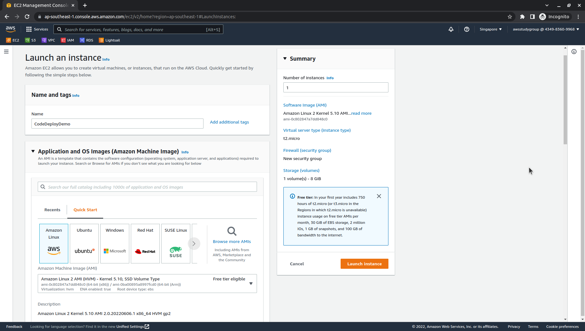
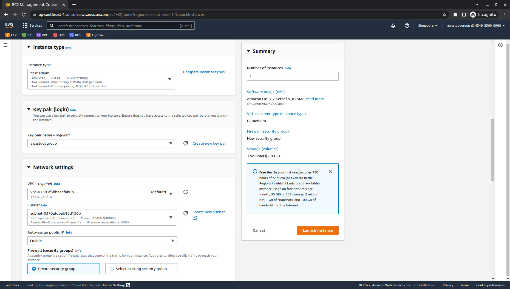
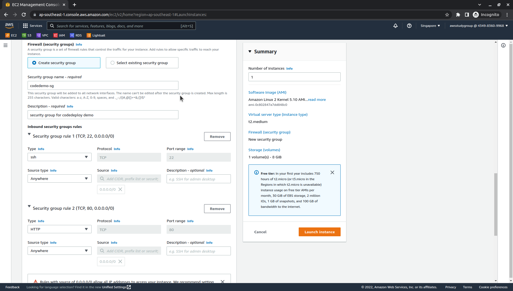
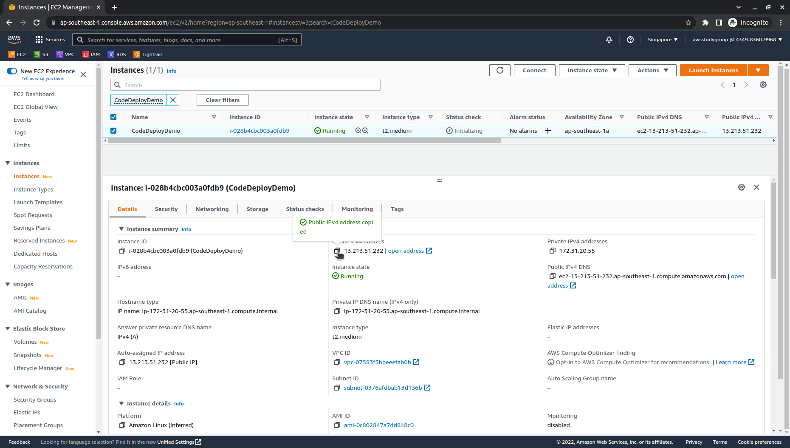

# 
1.1. Launch an Amazon EC2 instance

# Guide
1. Sign in to the AWS Management Console and open the Amazon EC2 console at https://console.aws.amazon.com/ec2/
2. In the navigation pane, choose **Instances**, and then choose **Launch Instance**.
   - Name: `CodeDeployDemo` (If you specify a different tag key or tag value, then the instructions in [Step 4. Deploy your WordPress application](WordPress-4.md) may produce unexpected results)
   - AMI: `Amazon Linux 2`
     - Architecture: `64-bit (x86)`

     

   - Instance type: `t2.medium`
   - Key pair: Create new key pair `awsstudygroup`
   
     

   - Network settings:
     - VPC: `default`
     - Subnet: a subnet of VPC default (default is public subnet)
     - Auto-assign public IP: `Enable`
     - Firewall (security groups): Create security group:
       - SSH / Port 22 / Anywhere
       - HTTP / Port 80 / Anywhere

     

   - Advanced details:
     - IAM instance profile: `CodeDeployDemo-EC2-Instance-Profile` - created before.

     

   Choose **Launch Instance**.

***

Next page: [Install the CodeDeploy agent for Amazon Linux](WordPress-1-2.md)