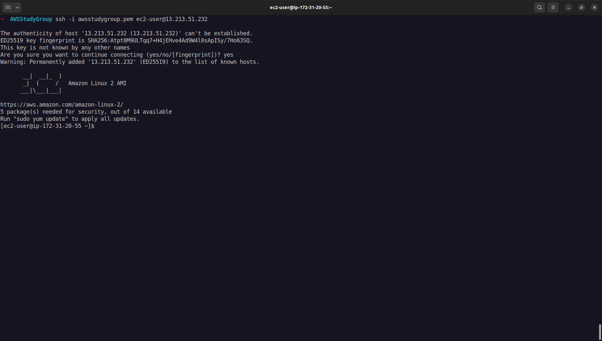
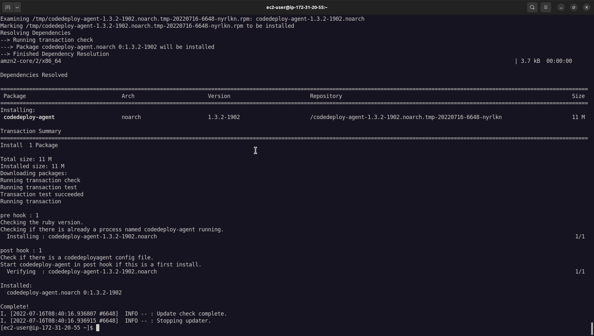
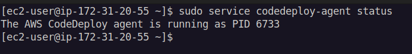

# <center>1.2. Install the CodeDeploy agent for Amazon Linux</center>

# Guide
To use CodeDeploy on EC2 instances or on-premises servers, the CodeDeploy agent must be installed first.

1. SSH to `CodeDeployDemo` EC2 - created before.



2. Run command to install CodeDeploy agent:

```
sudo yum update -y
sudo yum install ruby -y
sudo yum install wget -y
/opt/codedeploy-agent/bin/codedeploy-agent stop
sudo yum erase codedeploy-agent -y
cd /home/ec2-user/
wget https://bucket-name.s3.region-identifier.amazonaws.com/latest/install
chmod +x ./install
sudo ./install auto
```


Note for replace:
- `bucket-name`: is the name of the Amazon S3 bucket that contains the CodeDeploy Resource Kit files for your region
- `region-identifier` is the identifier for your region
Example: 
```
wget https://aws-codedeploy-ap-southeast-1.s3.ap-southeast-1.amazonaws.com/latest/install
```

Detail at [AWS page](https://docs.aws.amazon.com/codedeploy/latest/userguide/resource-kit.html#resource-kit-bucket-names).



3. To check that the service is running, run the following command:

```
sudo service codedeploy-agent status
```



4. If you see a message like error: No AWS CodeDeploy agent running, start the service and run the following two commands, one at a time:

```
sudo service codedeploy-agent start
sudo service codedeploy-agent status
```

***


Next page: [Configure your source content to be deployed to the Amazon Linux](WordPress-2-0.md)