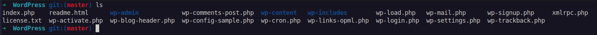

# <center>2.1. Get the source code</center>

# Guide
For this tutorial, you deploy the WordPress content publishing platform from your engineer machine to the target Amazon EC2 instance. To get the WordPress source code, you can use built-in command-line calls. Or, if you have Git installed on your engineer machine, you can use that instead.

For these steps, we assume you downloaded a copy of the WordPress source code to the `/tmp` directory on your engineer machine. (You can choose any directory you like, but remember to substitute your location for `/tmp` wherever it is specified in these steps.)

Choose one of the following two options to copy the WordPress source files to your engineer machine. The first option uses built-in command-line calls. The second option uses Git.

Use the first `or` the second option.

### **Option 1: To get a copy of the WordPress source code (built-in command-line calls)**
<details>
  <summary>Expand</summary>

```
wget https://github.com/WordPress/WordPress/archive/master.zip
unzip master -d /tmp/WordPress_Temp
cp -paf /tmp/WordPress_Temp/WordPress-master/* /tmp/WordPress
rm -rf /tmp/WordPress_Temp
rm -f master
```

</details>

### **Option 2: To get a copy of the WordPress source code (Git)**
<details>
  <summary>Expand</summary>

```
mkdir /tmp/WordPress
git clone https://github.com/WordPress/WordPress.git
```

</details>

<p>
</p>

After get WordPress source code:



***


Next page: [Create scripts to run your application](WordPress-2-2.md)