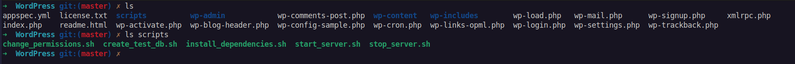

# <center>2.2. Create scripts to run your application</center>

# Guide
Next, create a folder and scripts in the directory. CodeDeploy uses these scripts to set up and deploy your application revision on the target Amazon EC2 instance. You can use any text editor to create the scripts.
1. Create a **scripts** directory in your copy of the **WordPress** source code:

```
mkdir -p /tmp/WordPress/scripts
```

2. Create an `install_dependencies.sh` file in `/tmp/WordPress/scripts`. Add the following lines to the file. This `install_dependencies.sh` script installs Apache, MySQL, and PHP. It also adds MySQL support to PHP.

```
#!/bin/bash
sudo amazon-linux-extras install php7.4
sudo yum install -y httpd mariadb-server php
```

3. Create a `start_server.sh` file in `/tmp/WordPress/scripts`. Add the following lines to the file. This `start_server.sh` script starts Apache and MySQL.

```
#!/bin/bash
systemctl start mariadb.service
systemctl start httpd.service
systemctl start php-fpm.service
```

4. Create a `stop_server.sh` file in `/tmp/WordPress/scripts`. Add the following lines to the file. This `stop_server.sh` script stops Apache and MySQL.

```
#!/bin/bash
isExistApp=pgrep httpd
if [[ -n $isExistApp ]]; then
systemctl stop httpd.service
fi
isExistApp=pgrep mysqld
if [[ -n $isExistApp ]]; then
systemctl stop mariadb.service
fi
isExistApp=pgrep php-fpm
if [[ -n $isExistApp ]]; then
systemctl stop php-fpm.service
fi
```

5. Create a `create_test_db.sh` file in `/tmp/WordPress/scripts`. Add the following lines to the file. This `create_test_db.sh` script uses MySQL to create a test database for WordPress to use.

```
#!/bin/bash
mysql -uroot <<CREATE_TEST_DB
CREATE DATABASE IF NOT EXISTS test;
CREATE_TEST_DB
```

6. Finally, create a `change_permissions.sh` script in `/tmp/WordPress/scripts`. This is used to change the folder permissions in Apache.

```
#!/bin/bash
chmod -R 777 /var/www/html/WordPress
```

7. Give all of the scripts executable permissions. On the command line, type:

```
chmod +x /tmp/WordPress/scripts/*
```

8. For lazy guy =)), download all at here and extract to `/tmp/WordPress/scripts/` and run step `7. Give all of the scripts executable permissions`.

[`change_permissions.sh`](./files/change_permissions.sh)

[`create_test_db.sh`](./files/`create_test_db.sh`)

[`install_dependencies.sh`](./files/install_dependencies.sh)

[`start_server.sh`](./files/`start_server.sh`)

[`stop_server.sh`](./files/`stop_server.sh`)


After create scripts in WordPress source code scrip:



***


Next page: [Add an application specification file](WordPress-2-3.md)