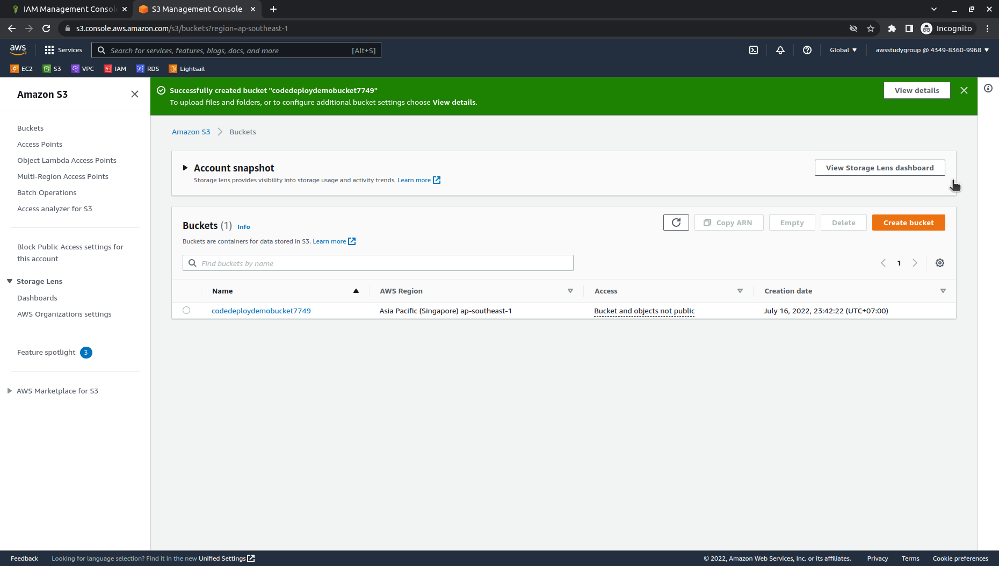
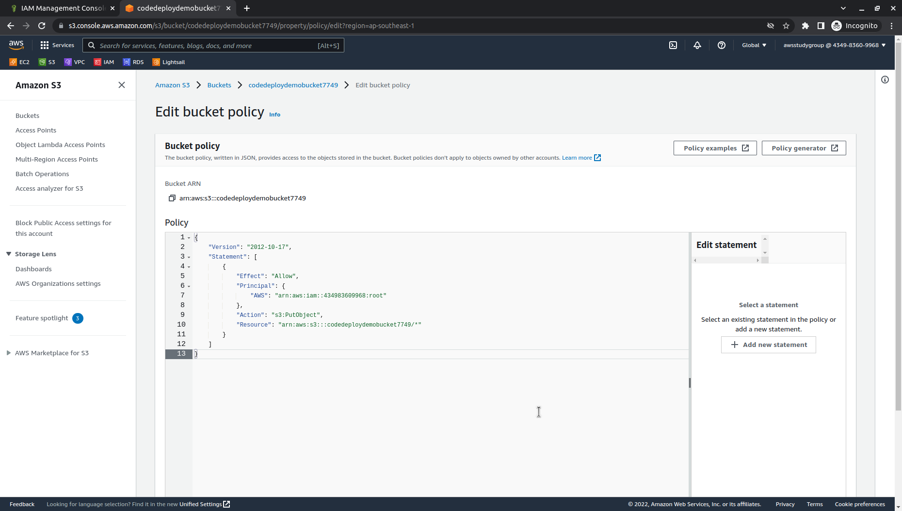
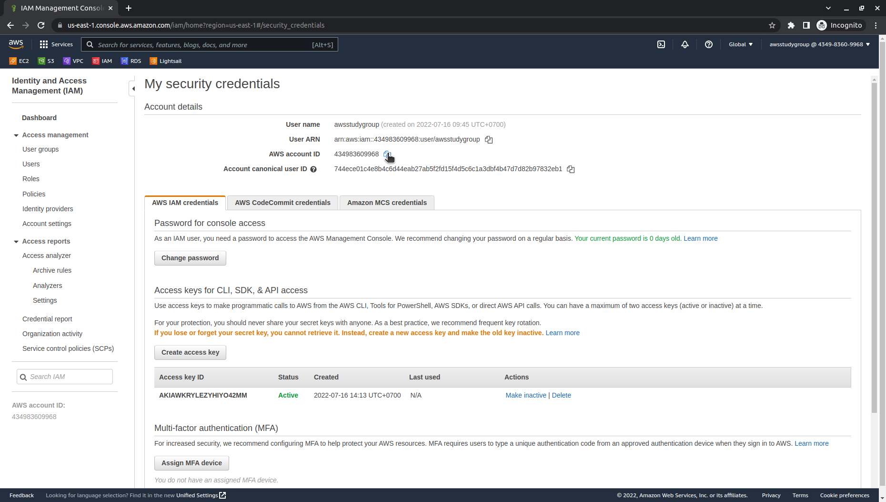
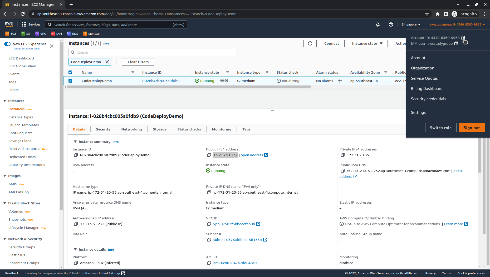

# <center>3.1. Provision an Amazon S3 bucket</center>

# Guide
Create a storage container or bucket in Amazon S3 or use an existing bucket. Make sure you can upload the revision to the bucket and that Amazon EC2 instances used in deployments can download the revision from the bucket.

Make sure to give access permissions to the bucket and your IAM user.

## 1.1. To create an Amazon S3 bucket
1. Open the Amazon S3 console at https://console.aws.amazon.com/s3/.

2. In the Amazon S3 console, choose **Create bucket**.

3. In the Bucket name box, type a name for the bucket. Ex: `codedeploydemobucket7749`

4. In the Region list, choose the target region, and then choose **Create**.



## 1.2. Give permissions to the Amazon S3 bucket and your IAM user
You must have permissions to upload to the Amazon S3 bucket. You can specify these permissions through an Amazon S3 bucket policy.

For example, in the following Amazon S3 bucket policy, using the wildcard character (*) allows AWS account `111122223333` to upload files to any directory in the Amazon S3 bucket named `codedeploydemobucket7749`:

```
{
    "Version": "2012-10-17",
    "Statement": [
        {
            "Action": [
                "s3:PutObject"
            ],
            "Effect": "Allow",
            "Resource": "arn:aws:s3:::codedeploydemobucket7749/*",
            "Principal": {
                "AWS": [
                    "111122223333"
                ]
            }
        }
    ]
}
```



To view your AWS account ID, click to https://console.aws.amazon.com/iam/home#/security_credentials.



**`OR`**



***


Next page: [Prepare the application's files for the bucket](WordPress-3-2.md)