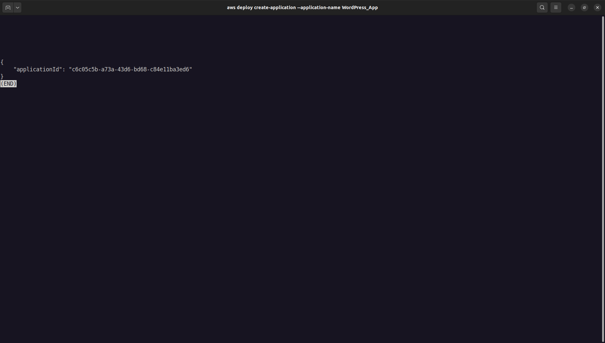
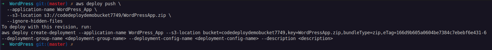

# <center>3.3. Bundle the application's files into a single archive file and push the archive file</center>

# Guide
Bundle the WordPress application files and the **AppSpec** file into an archive file (known as an application *revision*).

1. On the **Engineer machine**, switch to the folder where the files are stored:

```
cd /tmp/WordPress
```

2. Call the `create-application` command to register a new application named **WordPress_App**

```
aws deploy create-application --application-name WordPress_App
```



3. Call the CodeDeploy `push` command to bundle the files together, upload the revisions to Amazon S3, and register information with CodeDeploy about the uploaded revision, all in one action.

```
aws deploy push \
  --application-name WordPress_App \
  --s3-location s3://codedeploydemobucket7749/WordPressApp.zip \
  --ignore-hidden-files
```



This command bundles the files from the current directory (excluding any hidden files) into a single archive file named **WordPressApp.zip**, uploads the revision to the `codedeploydemobucket7749` bucket, and registers information with CodeDeploy about the uploaded revision.

***


Next page: [Deploy your WordPress application](WordPress-4-0.md)