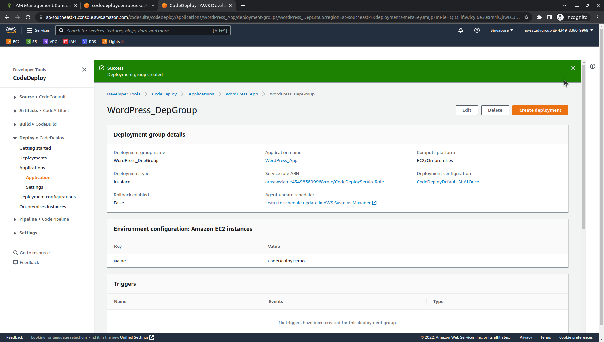
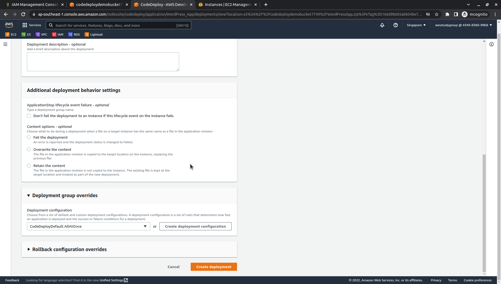

# 
4.1. Deploy your application revision with CodeDeploy

# Guide
1. Before you use the CodeDeploy console to deploy your application revision, you need a service role ARN. A service role is an IAM role that gives a service permission to act on your behalf. In this case, the service role gives CodeDeploy permission to access your Amazon EC2 instances to expand (read) their Amazon EC2 instance tags.

    You should have already followed the instructions in [Create a service role for CodeDeploy](WordPress-0-4.md) to create a service role and get the ARN of the service role.

2. Now that you have the ARN, use the CodeDeploy console to deploy your application revision:

    Sign in to the AWS Management Console and open the CodeDeploy console at https://console.aws.amazon.com/codedeploy.

3. In the navigation pane, expand **Deploy**, then choose **Applications**.

4. In the list of applications, choose **WordPress_App**.

5. On the **Deployment groups** tab, choose **Create deployment group**.

6. In **Deployment group name**, enter `WordPress_DepGroup`.

7. In **Service role**, choose role create before.

8. Under **Deployment type**, choose **In-place**.

9. In **Environment configuration**, select **Amazon EC2 instances**.

10. In **Key**, enter **Name**.

11. In **Value**, enter `CodeDeployDemo`.

    After you type **CodeDeployDemo**, a `1` should appear under Matching instances to confirm CodeDeploy found one matching Amazon EC2 instance.
 
12. In **Agent configuration with AWS Systems Manager**, keep the defaults.

13. Under **Deployment settings**, choose `CodeDeployDefault.OneAtATime` at **Deployment configuration**.

14. Under **Load balancer**, `uncheck` **Enable load balancing**.

15. choose **Create deployment group**.

16.  Come back to **WordPress_App**. 

17.  On the **Revisions** tab, check in link `s3 location`. choose **Deploy application**.

18.  In **Deployment group** choose `WordPress_DepGroup`.

19.  Next to **Revision type**, choose `My application is stored in Amazon S3`. In Revision type, enter the location of the sample WordPress application revision you previously uploaded to Amazon S3.

20. If a message appears in the File type list stating the file type could not be detected, choose `.zip`.

21. (Optional) Type a comment in the **Deployment description** box.

22. Expand **Deployment group overrides**, and from Deployment configuration, choose `CodeDeployDefault.OneAtATime`.

23. Choose **Start deployment**. Information about your newly created deployment appears on the Deployments page.

***

[Monitor and troubleshoot your deployment](WordPress-4-2.md)