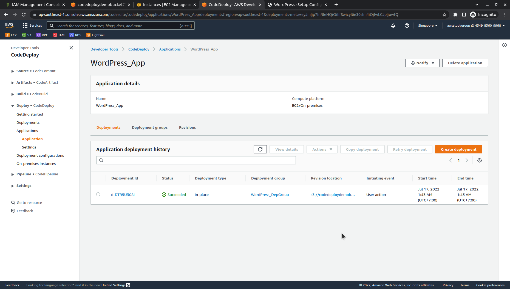
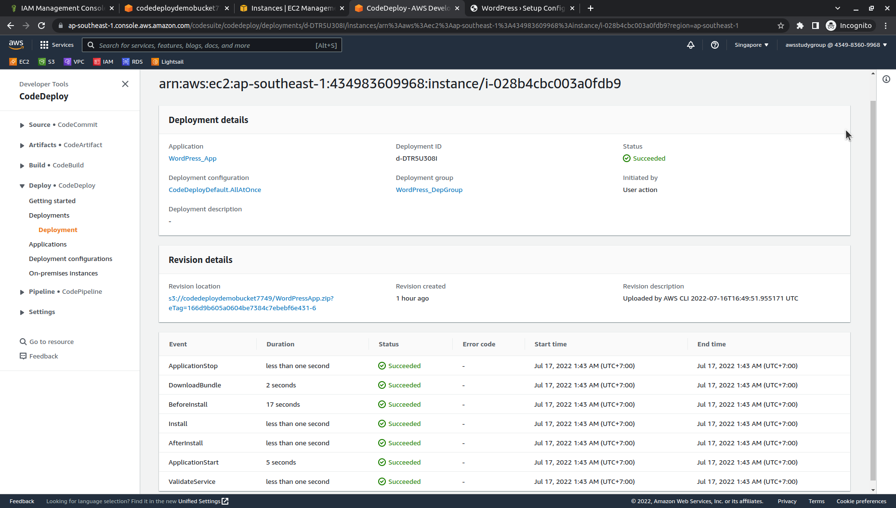
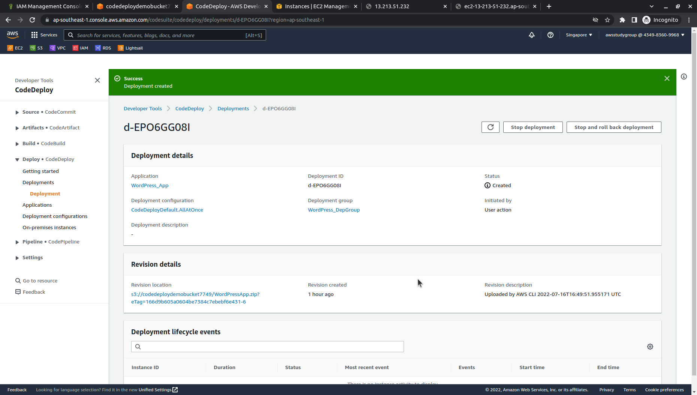
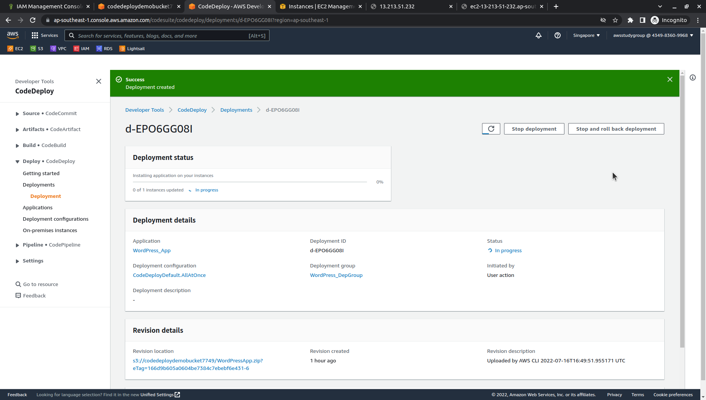
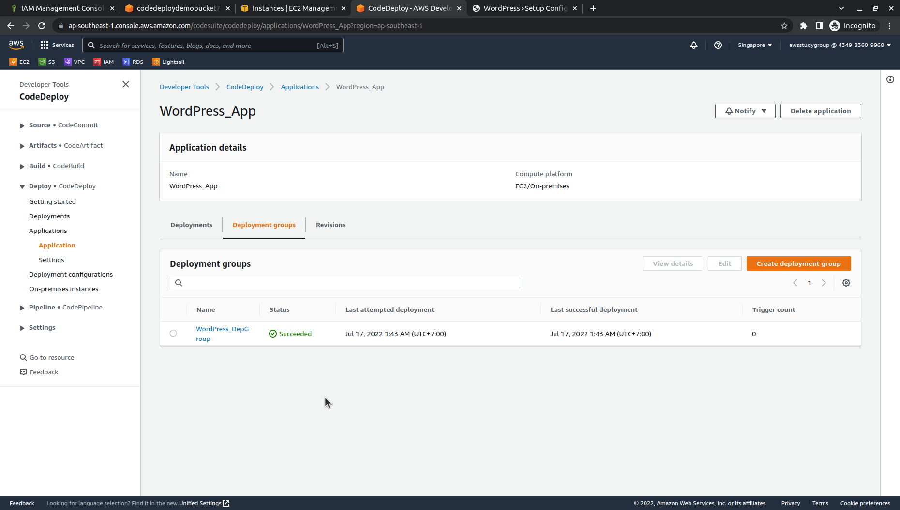
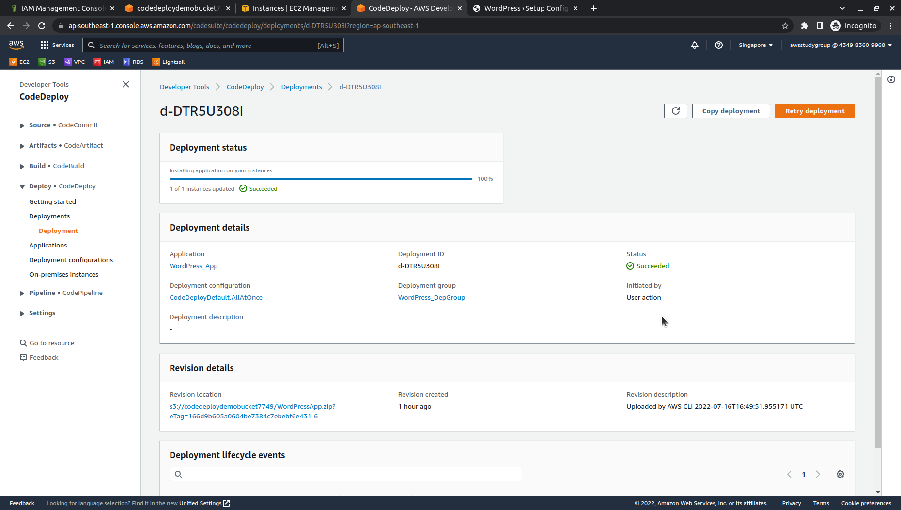

# 
4.2. Monitor and troubleshoot your deployment

# Guide
On the **Deployments** page in the CodeDeploy console, you can monitor your deployment's status in the **Status** column.

To get more information about your deployment, especially if the **Status** column value has any value other than **Succeeded**:

1. In the **Deployments** table, choose the name of the deployment. After a deployment fails, a message that describes the reason for the failure is displayed.

    

2. In **Instance activity**, more information about the deployment is displayed. After a deployment fails, you might be able to determine on which Amazon EC2 instances and at which step the deployment failed.

    

3. If you want to do more troubleshooting, you can use a technique like the one described in View Instance Details. You can also analyze the deployment log files on an Amazon EC2 instance. For more information, see Analyzing log files to investigate deployment failures on instances.

***

Next page: [Verify your deployment](WordPress-4-3.md)