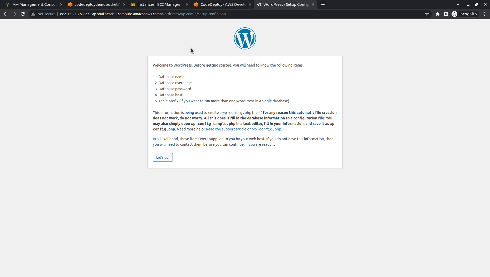

# 
4.3. Verify your deployment

# Guide
After your deployment is successful, verify your WordPress installation is working. Use the `public DNS address` of the Amazon EC2 instance, followed by `/WordPress`, to view your site in a web browser.

To get the public DNS value, in the Amazon EC2 console, choose the Amazon EC2 instance, and on the Description tab, look for the value of `Public DNS`.

For example, if the public DNS address of your Amazon EC2 instance is ec2-13-213-51-232.ap-southeast-1.compute.amazonaws.com, you would use the following URL:

    http://ec2-13-213-51-232.ap-southeast-1.compute.amazonaws.com/WordPress

***Note: use `http`, NOT https.***

When you view the site in your browser, you should see a WordPress welcome page that looks similar to the following:

***

Next page: [Clean up your WordPress application and related resources](WordPress-5-0.md)