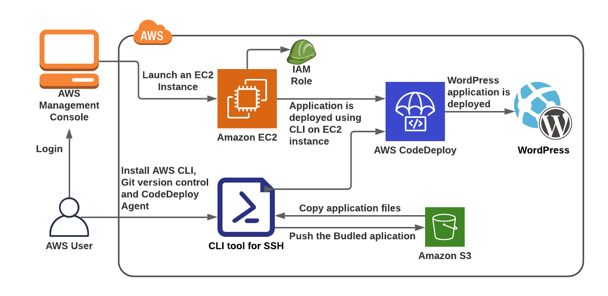

# 
Deploy WordPress to an Amazon EC2 instance using AWS CodeDeploy

## Overview
In this tutorial, you deploy WordPress, an open source blogging tool and content management system based on PHP and MySQL, to a single Amazon EC2 instance running Amazon Linux.

This tutorial's steps are presented from the perspective of a local development machine running Linux, macOS, or Unix. Although you can complete most of these steps on a local machine running Windows, you must adapt the steps that cover commands such as chmod and wget, applications such as sed, and directory paths such as `/tmp`.

Before you start this tutorial, you must complete the prerequisites in [Getting started with CodeDeploy](https://docs.aws.amazon.com/codedeploy/latest/userguide/getting-started-codedeploy.html). These include configuring your IAM user account, installing or upgrading the AWS CLI, and creating an IAM instance profile and a service role.

## Technical knowledge prerequisites
- AWS IAM
- AWS EC2
- AWS S3
- AWS CodeDeploy
- AWS CLI

***

## Tasks:
0. [Preparation](WordPress-0-0.md)
1. [Launch and configure an Amazon Linux](WordPress-1-0.md)
2. [Configure your source content to be deployed to the Amazon Linux](WordPress-2-0.md)
3. [Upload your WordPress application to Amazon S3](WordPress-3-0.md)
4. [Deploy your WordPress application](WordPress-4-0.md)
5. [Clean up your WordPress application and related resources](WordPress-5-0.md)

***

Next page: [Preparation](WordPress-0-0.md)